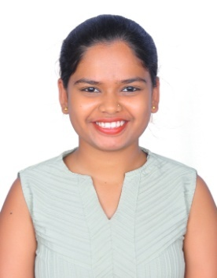

# 🎓 Final Year Project

> This repository hosts the code and documentation for our final year engineering project at Sinhgad College of Engineering, Pune - 411041.

---

## 📌 Project Overview

**Project Title**: _[To be decided]_  
**Domain**: _[AI/ML, Web Development, IoT, Cybersecurity, etc.]_

## 🛠️ Technologies Used

- Frontend: _[To be decided]_
- Backend: _[To be decided]_
- Database: _[To be decided]_
- Tools: Git, GitHub, VS Code, [Others...]

## 🚧 Project Status

> 🚧 Work in Progress – Project scope and technology stack will be finalized soon.

---

## 🧑‍🤝‍🧑 Team Members

| Photo | Name | Email | Contact |
|-------|------|-------|---------|
|  | **Divya Lipte** | liptedivya@gmail.com | +91-8080632014 |
|  | **Janhavi Kongari** | kongarijanhavi@gmail.com | +91-9322520619 |
|  | **Paras Joshi** | joshiparas217@gmail.com | +91-8767841672 |
|  | **Samruddhi Kadam** | samruddhik754@gmail.com | +91-9850740033 |

> 🖼️ Please place team photos in the `/team/` folder and ensure they're named correctly (e.g., `janhavi.jpg`).

---

## 🏫 Institution

**College**: Sinhgad College of Engineering, Pune-411041  
**Department**: Computer Engineering  
**University**: Savitribai Phule Pune University  
**Academic Year**: 2025–2026  
**Guide**: Prof. [Guide Name Placeholder]

---

## 📜 License

This project is licensed under the [MIT License](LICENSE).

## 📣 Contact

For queries or collaborations, feel free to contact any of the team members via email.

---

> _We will update this README as our project evolves. Stay tuned!_
